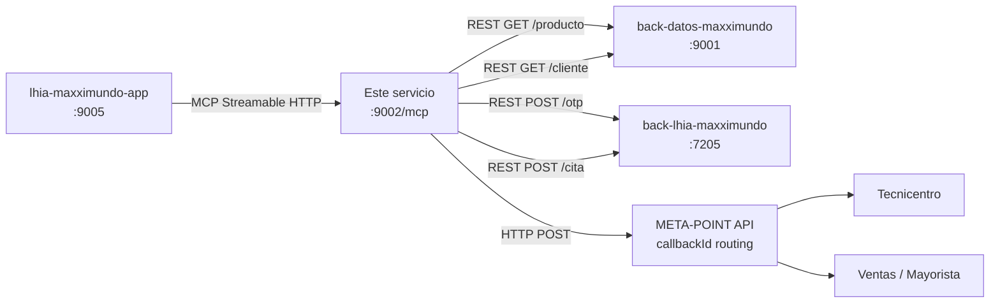
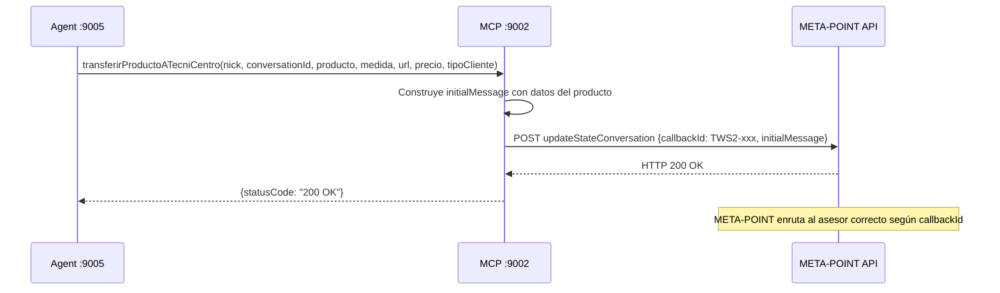

# lhia-maxximundo-mcp-webflux — MCP Context Server


Gateway MCP (Model Context Protocol) del ecosistema Maxximundo. Expone herramientas de negocio al agente LangChain: búsqueda de productos, transferencia de clientes a asesores, OTP, cartera y citas.

---

## Posición en la arquitectura



---

## Herramientas MCP disponibles (17 tools)

| Tool | Descripción |
|------|-------------|
| `searchProductos` | Busca productos con precio, stock y ficha técnica |
| `searchProductosSinPrecio` | Busca productos sin precios (usuario público) |
| `transferirProductoATecniCentro` | Transfiere cliente + producto al asesor de Tecnicentro |
| `updateStateTecniCentro` | Conecta cliente con Tecnicentro |
| `updateStateVentasAutollanta` | Conecta con ventas Autollanta |
| `updateStateVentasStox` | Conecta con ventas STOX |
| `updateStateVentasIkonix` | Conecta con ventas IKONIX |
| `updateStateVentasMaxximundo` | Conecta con ventas Maxximundo |
| `updateStateMarketing` | Conecta con Marketing |
| `updateStateCartera` | Conecta con Cartera |
| `updateStateTI` | Conecta con Tecnología / TI |
| `updateStateClubShellMaxx` | Info Club Shell Maxx |
| `getCarteraPorCedula` | Consulta cartera del mayorista por cédula/RUC |
| `enviarOtpPorCedula` | Envía OTP al correo del mayorista |
| `verificarOtpPorCedula` | Verifica código OTP ingresado |
| `validarYTransferirTI` | Valida si cliente existe; transfiere si no |
| `crearCita` | Agenda cita en Tecnicentro |
| `getClubShellInfo` | Consulta puntos Club Shell del cliente |

---

## Prerrequisitos

| Requisito | Versión |
|-----------|---------|
| Java (Amazon Corretto recomendado) | 17+ |
| Maven | 3.8+ |
| Servicios activos | `back-datos :9001`, `back-lhia :7205` |

---

## Cómo levantar (local)

```bash
# 1. Clonar
git clone <repo>
cd lhia-maxximundo-mcp-webflux

# 2. Compilar
./mvnw clean package -DskipTests

# 3. Ejecutar
./mvnw spring-boot:run
# O directamente:
java -jar target/maxximundo-mcp-server-0.0.1-SNAPSHOT.jar
```

El servidor queda disponible en: `http://localhost:9002/mcp`

> **Nota:** Los servicios `back-datos :9001` y `back-lhia :7205` deben estar activos antes de iniciar este servicio.

---

## Cómo levantar (producción — servidor 192.168.0.39)

```bash
# Ruta en servidor
cd /opt/lhia/spring/mcp

# Ver proceso activo
pgrep -a java | grep mcp

# Reiniciar (requiere sudo si el proceso es de root)
sudo kill $(pgrep -f mcp-server)
nohup java -jar maxximundo-mcp-server-0.0.1-SNAPSHOT.jar \
  >> /opt/lhia/spring/mcp/mcp-server.log 2>&1 &
```

---

## Configuración (application.properties)

```properties
server.port=9002
spring.ai.mcp.server.transport-mode=STREAMABLE

# Backend datos (SQL Server DWH)
lhia.api.base-url=http://localhost:9001

# Backend lhia (PostgreSQL / integraciones)
maxximundo.api.base-url=http://localhost:7205/maxximundo/maxximundo-api
```

En producción reemplazar `localhost` por `192.168.0.39`.

---

## Flujo de transferencia a asesor



---

*Desarrollado por TWS para Maxximundo — Cuenca, Ecuador.*
